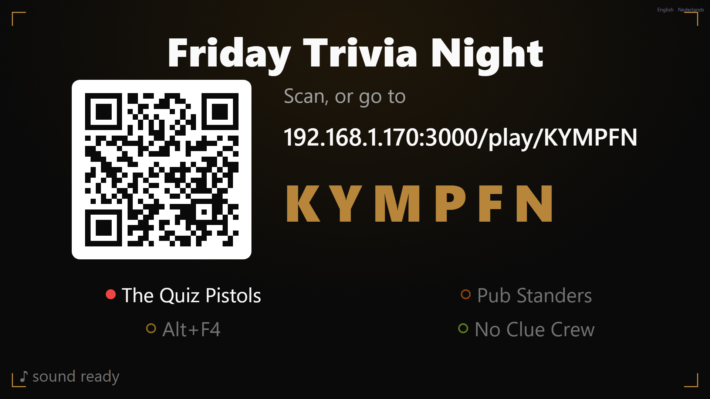
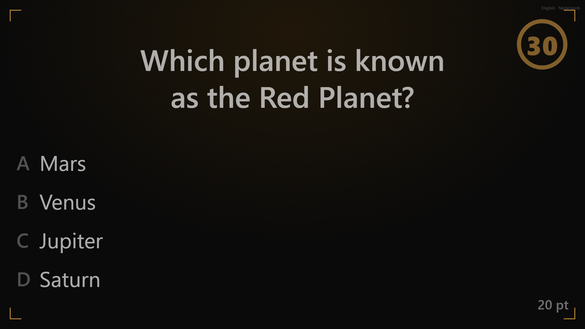
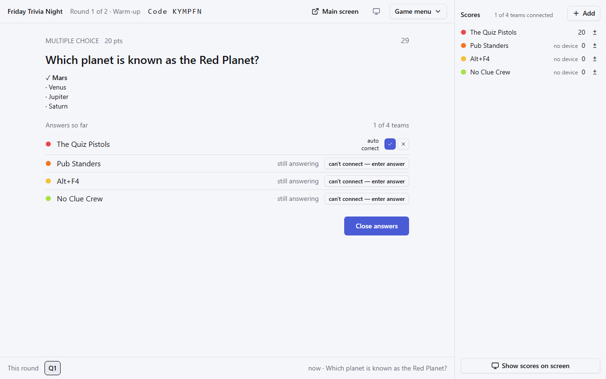
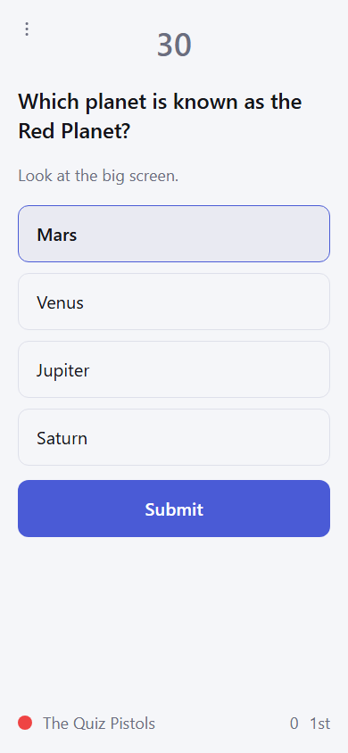
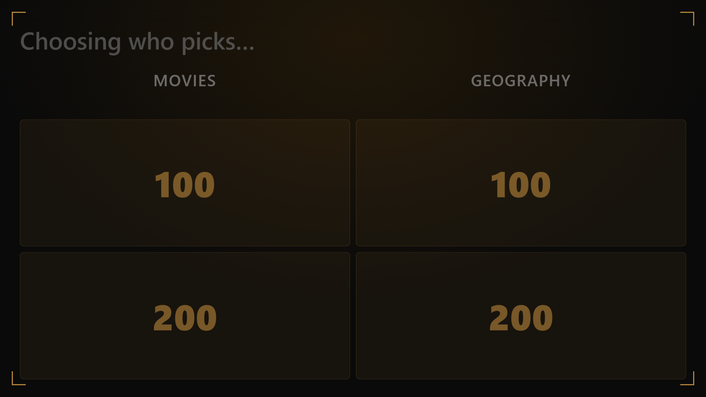
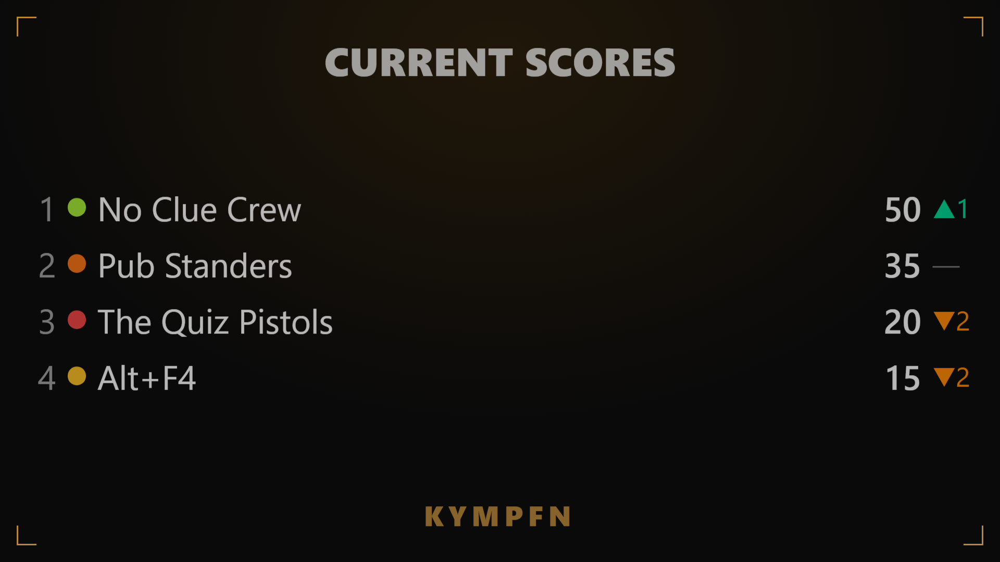

# Kwiz

**A pub-quiz engine that runs off your laptop, not someone else's cloud.**

No accounts. No app to install. No Wi-Fi required, even — a phone hotspot is enough. Plug
in a projector, hand your laptop the quizmaster's seat, and every team joins in seconds by
scanning a code with the one phone already on their table.

[](https://github.com/BelgianNoise/kwiz/actions/workflows/ci.yml)
[](LICENSE)



## Why

Every "quiz platform" out there wants an account, a subscription, or an internet
connection that a pub basement or a rented function room may not reliably have. Kwiz
doesn't. It's one Node process, one SQLite file, and four screens that all talk to each
other over your own local network:

- **The projector** — the room's shared view: the question, the board, the leaderboard,
  never anything a team shouldn't see yet.
- **The quizmaster's control desk** — where you actually run the night: open a question,
  judge a buzz, override a harsh auto-grade, adjust a score, without ever touching a
  keyboard the room can see.
- **One phone per team** — no per-player app, no per-player login. A team joins with a
  tap and answers together, the way a real team at a real table does.
- **A setup screen** — write your questions, build a Jeopardy-style board, and preview the
  whole thing before you ever face a live room.

Kill the server mid-game and restart it — nothing is lost. Every score, every buzz order,
every clock is derived from a durable log, not held in memory waiting to disappear.

## See it in action

| | |
|---|---|
|  **On the big screen** — questions, boards and reveals, sized to be read from the back of the room. |  **At the control desk** — every team's answer as it lands, auto-graded where it can be, one tap to override where it can't. |
|  **On the phone in your hand** — big tap targets, no autocorrect fighting your answers, works one-handed at a crowded table. |  **Jeopardy rounds, buzzers and all** — categories, a value ladder, and a live buzz-in with two-decimal timing. |



*A leaderboard moment is free drama: rank, score, and who moved since last time — the
kind of thing a room reacts to out loud.*

## Quick start

Requires [Node](https://nodejs.org) 24+ and [pnpm](https://pnpm.io). Everything else —
including the database — is created on first run; there's nothing to provision.

```bash
pnpm install
pnpm dev
```

Open `http://localhost:3000`, host a quiz, and open `/screen`, `/control` and `/play` in
separate tabs (or separate devices on the same network) to see all three surfaces talk to
each other live. For a real night:

```bash
pnpm build
pnpm start
```

...then point your projector and every team's phone at whatever address the setup screen
shows you — no domain, no HTTPS, no port-forwarding required, because everyone is already
on the same network as your laptop.

## How a night actually runs

1. **Write your quiz** in the setup screen — free-text, multiple-choice, buzzer and
   Jeopardy-style rounds, plus a keyword-guessing finale for the last round of the night.
2. **Start the game.** The main screen shows a join code and QR; teams tap in on one
   phone each.
3. **Run the room from the control desk.** Open a question, watch answers land live,
   override anything the auto-grader got wrong, and move on when the room's ready — never
   on a timer you don't control.
4. **Let the projector do the talking.** Reveals, leaderboards and the finale's keyword
   board are built to be read from across the room, in light or dark, in English or Dutch.

## Under the hood

- **Next.js** app serving all four surfaces, with **Server-Sent Events** pushing live,
  fully-filtered views to every connected screen — no WebSockets, no client-side game
  logic, no secret ever sent to a screen that shouldn't see it.
- **SQLite**, via Drizzle ORM — one file, event-sourced: every score, buzz and answer is
  derived by replaying a durable event log, never stored as a mutable fact.
- **A pure domain package** for the actual game rules (scoring, buzz ordering, answer
  matching) — no database, no framework, no network in sight, which is what makes it
  fully unit-testable and what would let a future transport (say, WebSockets) swap in
  without touching the rules at all.
- **A real test suite**: unit tests for the game rules and the payload-filtering
  invariants that keep secrets off the wire, plus an end-to-end browser suite that walks
  every projected stage in both locales.

The full design — every non-obvious decision and *why* — lives in [`docs/`](docs), if
you want to go deeper than this file does.

## License

[MIT](LICENSE).

## Status

Feature-complete for a real quiz night: setup, live control, the projected screen, the
player phone, Jeopardy rounds and a keyword finale all work end to end, in English and
Dutch, and are covered by an automated test suite. What's left is the kind of thing only a
live room finds — see [`docs/field-rehearsal.md`](docs/field-rehearsal.md) for that
runbook.

---

*Built with AI assistance (mostly Claude Sonnet), from a fully-specified design down to
most of the implementation and tests. Reviewed and directed by a human throughout, not
generated and walked away from.*
